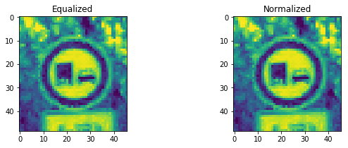

## Project: Build a Traffic Sign Recognition Program
[](http://www.udacity.com/drive)

Overview
---
In this project, you will use what you've learned about deep neural networks and convolutional neural networks to classify traffic signs. You will train and validate a model so it can classify traffic sign images using the [German Traffic Sign Dataset](http://benchmark.ini.rub.de/?section=gtsrb&subsection=dataset). After the model is trained, you will then try out your model on images of German traffic signs that you find on the web.

The Project
---
The goals / steps of this project are the following:
* Load the data set
* Explore, summarize and visualize the data set
* Design, train and test a model architecture
* Use the model to make predictions on new images
* Analyze the softmax probabilities of the new images
* Summarize the results with a written report

### Dependencies
This lab requires:

* [CarND Term1 Starter Kit](https://github.com/udacity/CarND-Term1-Starter-Kit)

The lab environment can be created with CarND Term1 Starter Kit. Click [here](https://github.com/udacity/CarND-Term1-Starter-Kit/blob/master/README.md) for the details.

### Dataset and Repository

1. Download the data set. The classroom has a link to the data set in the "Project Instructions" content. This is a pickled dataset in which we've already resized the images to 32x32. It contains a training, validation and test set.
2. Clone the project, which contains the Ipython notebook and the writeup template.
```sh
git clone https://github.com/udacity/CarND-Traffic-Sign-Classifier-Project
cd CarND-Traffic-Sign-Classifier-Project
jupyter notebook Traffic_Sign_Classifier.ipynb
```


[//]: # (Image References)

[image1]: ./examples/visualization.jpg "Visualization"
[image2]: ./examples/grayscale.jpg "Grayscaling"
[image3]: ./examples/random_noise.jpg "Random Noise"
[image4]: ./examples/placeholder.png "Traffic Sign 1"
[image5]: ./examples/placeholder.png "Traffic Sign 2"
[image6]: ./examples/placeholder.png "Traffic Sign 3"
[image7]: ./examples/placeholder.png "Traffic Sign 4"
[image8]: ./examples/placeholder.png "Traffic Sign 5"

---
### Writeup

#### 1. This writeup includes all the rubric points and how I addressed each one.

Here is a link to my [project code](https://github.com/ayertay/Traffic_Sign_Classifier/blob/main/Traffic_Sign_Classifier.ipynb)

### Data Set Summary & Exploration

#### 1. Provide a basic summary of the data set. In the code, the analysis should be done using python, numpy and/or pandas methods rather than hardcoding results manually.

I used the pandas library to calculate summary statistics of the traffic
signs data set:

* The size of training set is 34799
* The size of the validation set is 4410
* The size of test set is 12630
* The shape of a traffic sign image is (32, 32, 3)
* The number of unique classes/labels in the data set is 43

#### 2. Include an exploratory visualization of the dataset.

Here is an exploratory visualization of the data set. Figure below shows randomly selected images from the dataset.


Historgram shows the distribution of the traffic signals in the training dataset where it can be seen that data labeled 2 to 14 appears more frequently than others.


### Design and Test a Model Architecture

#### 1. Describe how you preprocessed the image data. What techniques were chosen and why did you choose these techniques? Consider including images showing the output of each preprocessing technique. Pre-processing refers to techniques such as converting to grayscale, normalization, etc.

As a first step, I decided to convert the images to grayscale for the CNN to focus on shape rather than color. 

Here is an example of a traffic sign image before and after grayscaling.


Afer that I had to improve the contrast of the images and equilized the histogram for all the images. 

Here is an example of a traffic sign image before and after equalizing.


As a last step, I normalized the image data to bring the mean to 0 and make it easier for CNN to train.



#### 2. Describe what your final model architecture looks like including model type, layers, layer sizes, connectivity, etc.) Consider including a diagram and/or table describing the final model.

My final model consisted of the following layers:

| Layer         		|     Description	        					| 
|:---------------------:|:---------------------------------------------:| 
| Input         		| 32x32x3 RGB image   							| 
| Convolution 5x5     	| 1x1 stride, VALID padding, outputs 28x28x6 	|
| RELU					|												|
| Max pooling	      	| 2x2 stride, VALID padding, outputs 14x14x6 	|
| Convolution 5x5	    | 1x1 stride, VALID padding, outputs 10x10x16   |
| RELU					|												|
| Max pooling	      	| 2x2 stride, VALID padding, outputs 5x5x16 	|
| Fully connected		| inputs 400, outputs 120           			|
| RELU					|												|
| Fully connected		| inputs 120, outputs 84               			|
| RELU					|												|
| Fully connected		| inputs 84, outputs 43               			|

Model used is LeNet. Model achieved the required accuracy of more than 93% after I properly pre-processed the image, lowered the learning rate, and increased number of Epochs to 64.  


#### 3. Describe how you trained your model. The discussion can include the type of optimizer, the batch size, number of epochs and any hyperparameters such as learning rate.

To train the model, I used an Adam optimizer. I lowered the learning rate, and increased number of epochs to 64. Batch size was kept at 128.

#### 4. Describe the approach taken for finding a solution and getting the validation set accuracy to be at least 0.93. Include in the discussion the results on the training, validation and test sets and where in the code these were calculated. Your approach may have been an iterative process, in which case, outline the steps you took to get to the final solution and why you chose those steps. Perhaps your solution involved an already well known implementation or architecture. In this case, discuss why you think the architecture is suitable for the current problem.

My final model results were:
* training set accuracy of 93.9
* validation set accuracy of 93.9 
* test set accuracy of 90.9

I went with LeNet architecture that was provided in the previous excercise. First I tried to just adjust the epoch and learning rate, but it didn't help. I got better results after properly pre-processing the images. After that I lowered the learning rate and adjusted the epoch size.
 

### Test a Model on New Images

#### 1. Choose five German traffic signs found on the web and provide them in the report. For each image, discuss what quality or qualities might be difficult to classify.

Here are eight German traffic signs that I found on the web:


4th image from the left might be difficult to classify since its blurry. It was hard for me to determine what sign that is. 

#### 2. Discuss the model's predictions on these new traffic signs and compare the results to predicting on the test set. At a minimum, discuss what the predictions were, the accuracy on these new predictions, and compare the accuracy to the accuracy on the test set.

The model was able to correctly guess all of the traffic signs, which gives an accuracy of 100%.

Following are the top 5 results for the images:
- Image of Speed limit (100km/h):
   - Classified correctly.
   - Probabilities:
    - **0.99322 : 7 - Speed limit (100km/h)**
    - 0.00631   : 8 - Speed limit (120km/h)
    - 0.0004    : 5 - Speed limit (80km/h)
    - 0.00004   : 3 - Speed limit (60km/h)
    - 0.00002   : 9 - No passing

- Image of yield sign:
  - Classified correctly.
  - Probabilities:
    - **1.000000 : 13 - Yield**
    - 0.000000 : 12 - Priority road
    - 0.000000 : 9 - No passing
    - 0.000000 : 35 - Ahead only
    - 0.000000 : 7 - Speed limit (100km/h)

- Image of ahead only:
  - Classified correctly.
  - Probabilities:
    - **1.000000 : 35 - Ahead only**
    - 0.000000 : 9 - No passing
    - 0.000000 : 3 - Speed limit (60km/h)
    - 0.000000 : 15 - No vehicles
    - 0.000000 : 5 - Speed limit (80km/h)

- Image of no passing for vehicles over 3.5 metric tons:
  - Classified correctly.
  - Probabilities:
    - **1.000000 : 10 - No passing for vehicles over 3.5 metric tons**

- Image of end of speed limit (80km/h):
  - Classified correctly.
  - Probabilities:
    - **1.000000 : 6 - End of speed limit (80km/h)**

- Image of no passing for vehicles over 3.5 metric tons:
  - Classified correctly.
  - Probabilities:
    - **1.000000 : 10 - No passing for vehicles over 3.5 metric tons**

- Image of Priority road:
  - Classified correctly.
  - Probabilities:
    - **1.000000 : 12 - Priority road**


- Image of Road narrows on the right:
  - Classified correctly.
  - Probabilities:
    - **1.000000 : 24 - Road narrows on the right**

 which means that except the first image which is speed limit of 100 kmh, CNN had 100% confidence determining the signs. For the first image it has 99% confidence.


